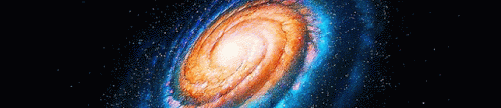

<h1 align="left">
    Hi , &nbsp; I'm Victor !
</h1>

- 🎓 Engineering student with a passion for physics and informatics, seeking to explore their crossroads !
- 👨🏼‍⚕️ Curious, social, dynamic, open-minded, and organized individual
- 🌿 Thrives on tackling new problems and projects, especially through collaboration
- 🗣 Fluent in French and English, with some good knowledge of German
- 💬 Favorite quote:
> For what's money without happiness ? Or hard times without the people you love ? - J. Cole

<h1 align="left">
    Coding Skills
</h1>

  

<a href="https://www.flaticon.com/free-icons/python" title="python icons">Python icons created by Freepik - Flaticon</a>

<h1 align="left">
    Software Skills
</h1>

<!--
**VikVador/VikVador** is a ✨ _special_ ✨ repository because its `README.md` (this file) appears on your GitHub profile.

Here are some ideas to get you started:

- 🔭 I’m currently working on ...
- 🌱 I’m currently learning ...
- 👯 I’m looking to collaborate on ...
- 🤔 I’m looking for help with ...
- 💬 Ask me about ...
- 📫 How to reach me: ...
- 😄 Pronouns: ...
- ⚡ Fun fact: ...
-->
