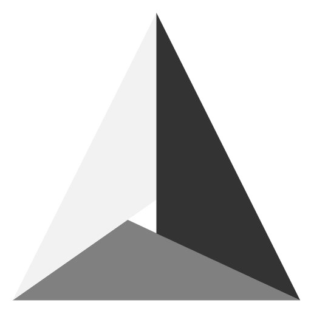

<h1 align="left">
    Hi , &nbsp; I'm Victor !
</h1>

- 🎓 Engineering student with a passion for physics and informatics, seeking to explore their crossroads !
- 👨🏼‍⚕️ Curious, social, dynamic, open-minded, and organized individual
- 🌿 Thrives on tackling new problems and projects, especially through collaboration
- 🗣 Fluent in French and English, with some good knowledge of German
- 💬 Favorite quote:
> For what's money without happiness ? Or hard times without the people you love ? - J. Cole

<h1 align="left">
    Coding & Frameworks Skills
</h1>

    
    
    
    
    
    
    
    
    
    
    
    

> <a href="https://www.flaticon.com/free-icons/python" style="no" target="_blank" title="Icons">Flaticon</a>

<h1 align="left">
    Software & Usefull Skills
</h1>

    
    
    
    
    
    
    
    
    
    
    
    

<h1 align="left">
    Stats
</h1>

<table border="0">
 <tr>
    
 </tr>
 <tr>
    <td>Lorem ipsum ...</td>
    <td>Lorem ipsum ...</td>
 </tr>
</table>

